# Azkaban使用教程

## 介绍

[TOC]

## 界面介绍

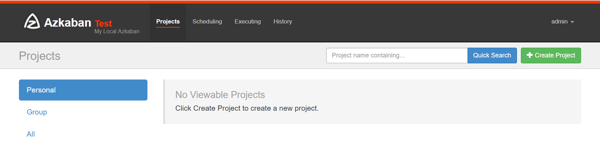

首页有四个菜单

- projects：最重要的部分，创建一个工程，所有flows将在工程中运行。
- scheduling:显示定时任务
- executing:显示当前运行的任务
- history:显示历史运行任务

## 介绍projects部分

### 概念介绍

**创建工程**：创建之前我们先了解下之间的关系，一个工程包含一个或多个flows，一个flow包含多个job。job是你想在azkaban中运行的一个进程，可以是简单的linux命令，可是java程序，也可以是复杂的shell脚本，当然，如果你安装相关插件，也可以运行插件。一个job可以依赖于另一个job，这种**多个job和它们的依赖组成的图表叫做flow**。

### 1、Command 类型单一 job 示例

#### （1）首先创建一个工程，填写名称和描述

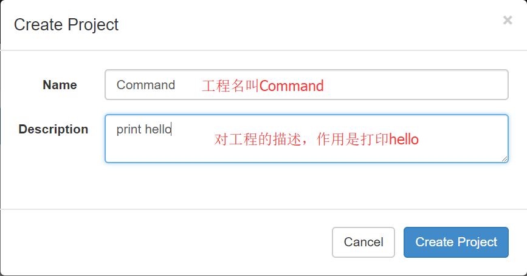

#### （2）点击创建之后

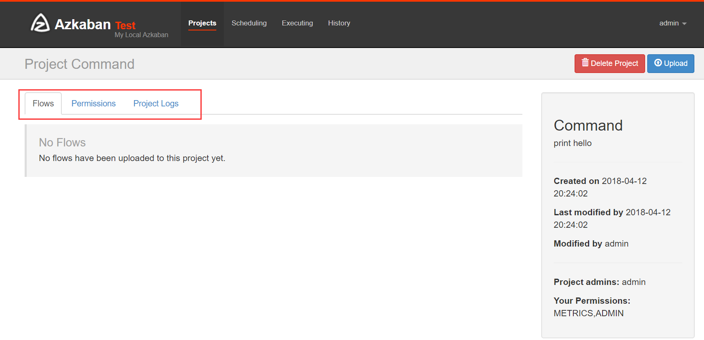

Flows：工作流程，有多个job组成
Permissions:权限管理
Project Logs:工程日志

#### （3）job的创建

创建job很简单，只要创建一个以.job结尾的文本文件就行了,例如我们创建一个工作，用来打印hello，名字叫做command.job

> \#command.job
>
> type=command
>
> command=echo 'hello'

一个简单的job就创建好了，解释下，type的command，告诉azkaban用unix原生命令去运行，比如原生命令或者shell脚本，当然也有其他类型，后面说。

一个工程不可能只有一个job，我们现在创建多个依赖job，这也是采用azkaban的首要目的。

#### （4）将 job 资源文件打包

**注意：只能是zip格式**

****

#### （5）通过 azkaban web 管理平台创建 project 并上传压缩包

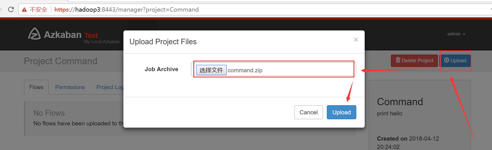

 

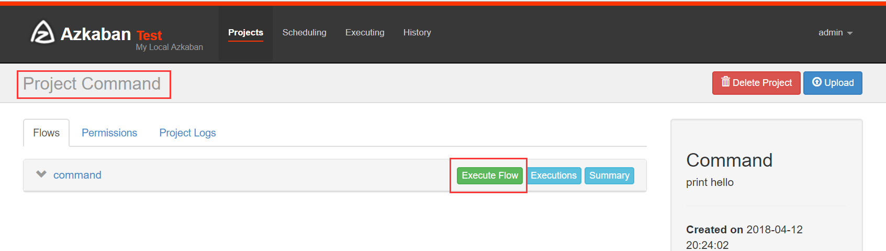

 

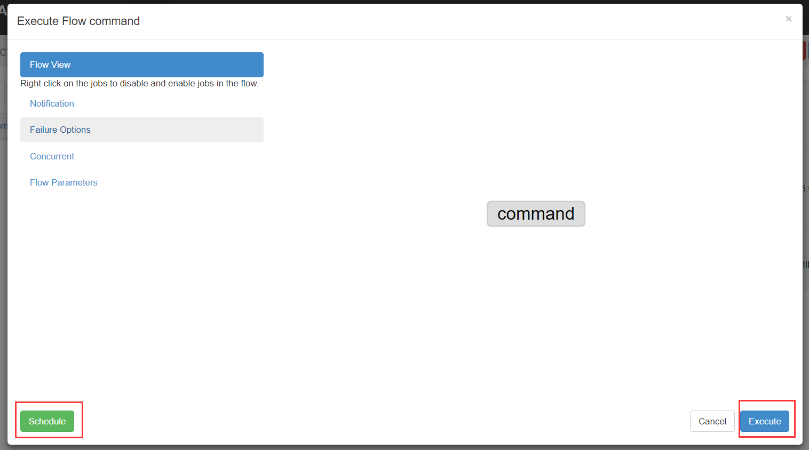

 

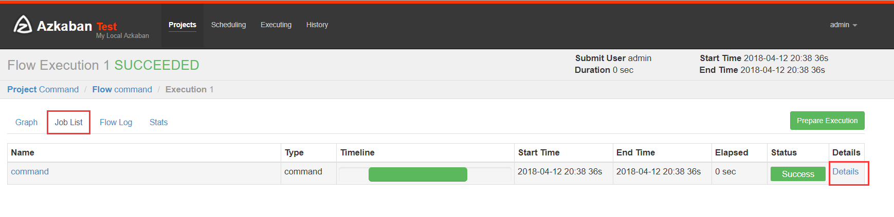

 


### 2、Command 类型多 job 工作流 flow

#### （1）创建项目

我们说过多个jobs和它们的依赖组成flow。怎么创建依赖，只要指定dependencies参数就行了。比如导入hive前，需要进行数据清洗，数据清洗前需要上传，上传之前需要从ftp获取日志。
定义5个job：

> 1、o2o_2_hive.job：将清洗完的数据入hive库
>
> 2、o2o_clean_data.job：调用mr清洗hdfs数据
>
> 3、o2o_up_2_hdfs.job：将文件上传至hdfs
>
> 4、o2o_get_file_ftp1.job：从ftp1获取日志
>
> 5、o2o_get_file_fip2.job：从ftp2获取日志

依赖关系：
3依赖4和5，2依赖3，1依赖2，4和5没有依赖关系。

o2o_2_hive.job

```
type=command
# 执行sh脚本，建议这样做，后期只需维护脚本就行了，azkaban定义工作流程
command=sh /job/o2o_2_hive.sh
dependencies=o2o_clean_data
```

o2o_clean_data.job

```
type=command
# 执行sh脚本，建议这样做，后期只需维护脚本就行了，azkaban定义工作流程
command=sh /job/o2o_clean_data.sh
dependencies=o2o_up_2_hdfs
```

o2o_up_2_hdfs.job

```
type=command
#需要配置好hadoop命令，建议编写到shell中，可以后期维护
command=hadoop fs -put /data/*
#多个依赖用逗号隔开
dependencies=o2o_get_file_ftp1,o2o_get_file_ftp2
```

o2o_get_file_ftp1.job

```
type=command
command=wget "ftp://file1" -O /data/file1
```

o2o_get_file_ftp2.job

```
type=command
command=wget "ftp:file2" -O /data/file2
```

可以运行unix命令，也可以运行python脚本（强烈推荐）。将上述job打成zip包。
ps：为了测试流程，我将上述command都改为echo ＋相应命令

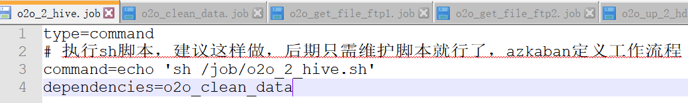

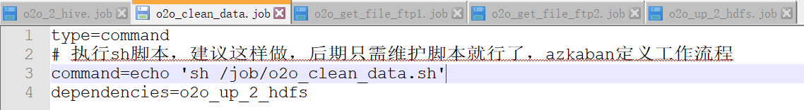

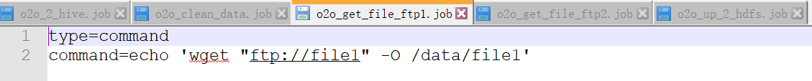


#### （2）上传

 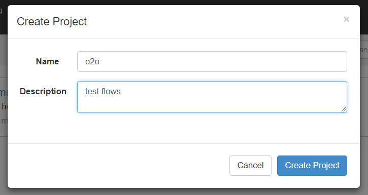

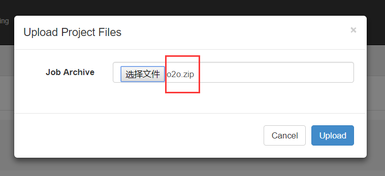

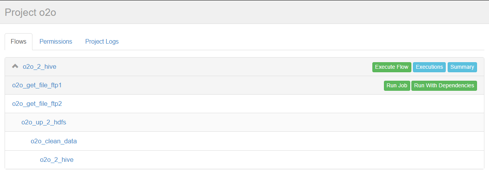

点击o2o_2_hive进入流程，azkaban流程名称以最后一个没有依赖的job定义的。

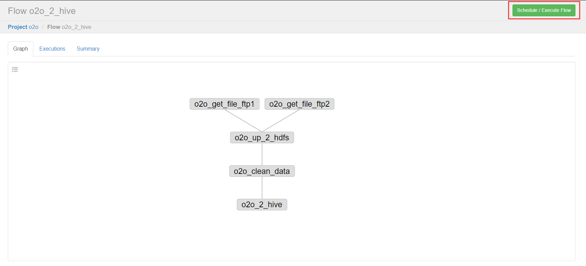

右上方是配置执行当前流程或者执行定时流程。

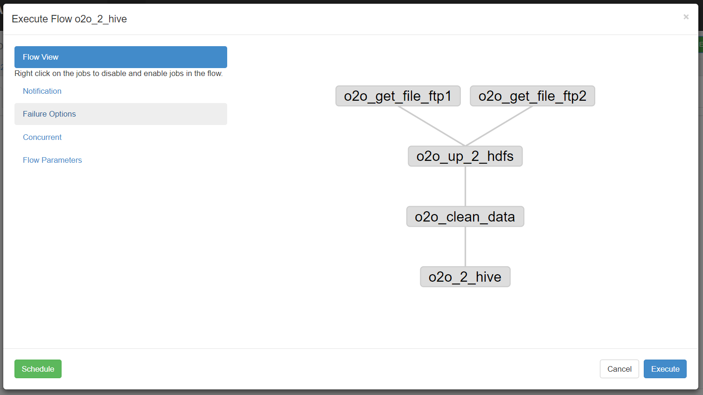

说明

> Flow view：流程视图。可以禁用，启用某些job
> Notification:定义任务成功或者失败是否发送邮件
> Failure Options:定义一个job失败，剩下的job怎么执行
> Concurrent：并行任务执行设置
> Flow Parametters：参数设置。

#### （3）执行一次

设置好上述参数，点击execute。

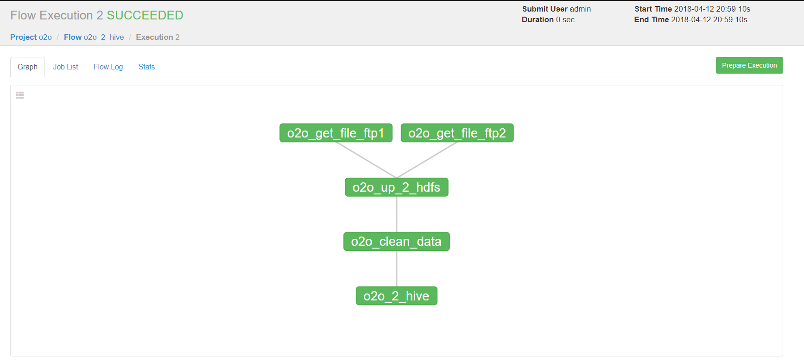

**绿色代表成功**，**蓝色是运行**，**红色是失败**。可以查看job运行时间，依赖和日志，点击details可以查看各个job运行情况。


 

#### （4）执行定时任务

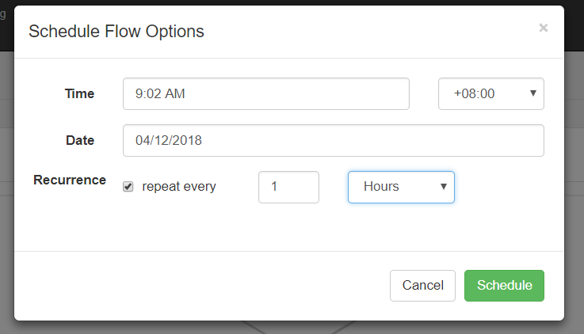

这时候注意到cst了吧，之前需要将配置中时区改为Asia/shanghai。
可以选择"天/时/分/月/周"等执行频率。

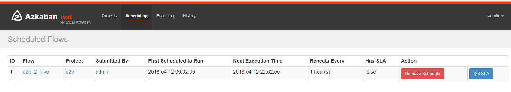

可以查看下次执行时间。

### 3、操作 MapReduce 任务

#### （1）创建 job 描述文件

mapreduce_wordcount.job

\# mapreduce_wordcount.job
type=command
dependencies=mapreduce_pi
command=/home/hadoop/apps/hadoop-2.7.5/bin/hadoop jar /home/hadoop/apps/hadoop-2.7.5/share/hadoop/mapreduce/hadoop-mapreduce-examples-2.7.5.jar wordcount /wordcount/input /wordcount/output_azkaban

mapreduce_pi.job

\# mapreduce_pi.job
type=command
command=/home/hadoop/apps/hadoop-2.7.5/bin/hadoop jar /home/hadoop/apps/hadoop-2.7.5/share/hadoop/mapreduce/hadoop-mapreduce-examples-2.7.5.jar pi 5 5

#### （2）创建 project 并上传 zip 包


#### （3）启动执行

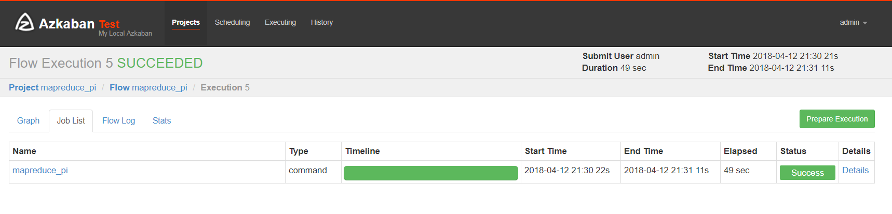

### 4、Hive 脚本任务

#### （1） 创建 job 描述文件和 hive 脚本

 Hive 脚本如下

 test.sql

[](javascript:void(0);)

```
create database if not exists azkaban;
use azkaban;
drop table if exists student;
create table student(id int,name string,sex string,age int,deparment string) row format delimited fields terminated by ',';
load data local inpath '/home/hadoop/student.txt' into table student;
create table student_copy as select * from student;
insert overwrite directory '/aztest/hiveoutput' select count(1) from student_copy;
!hdfs dfs -cat /aztest/hiveoutput/000000_0;
drop database azkaban cascade; 
```

[](javascript:void(0);)

 Job 描述文件：

hivef.job

```
# hivef.job
type=command
command=/home/hadoop/apps/apache-hive-2.3.3-bin/bin/hive -f 'test.sql'
```

#### （2）将所有 job 资源文件打到一个 zip 包中

#### （3）在 azkaban 的 web 管理界面创建工程并上传 zip 包

 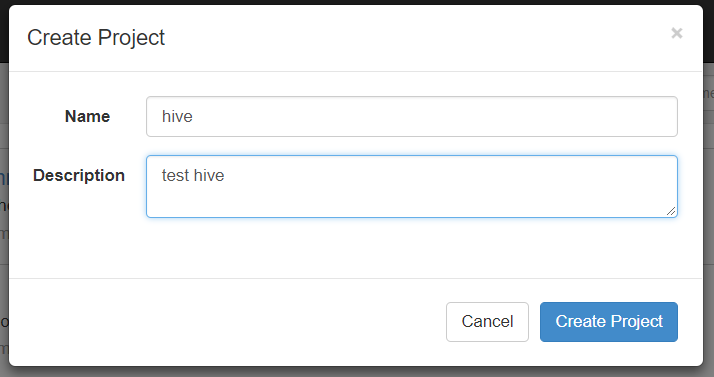

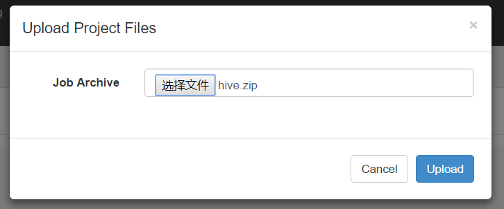

5、启动 job

### 参考链接

[Azkaban的使用](https://www.cnblogs.com/frankdeng/p/9284644.html)