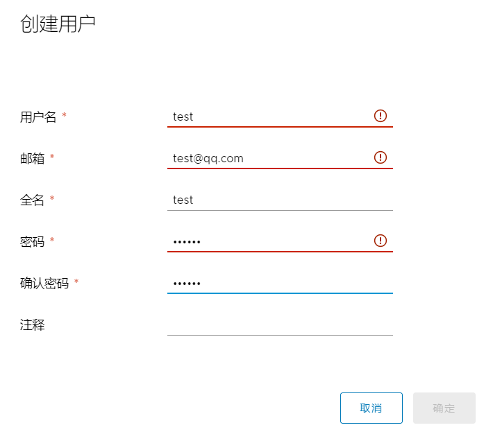
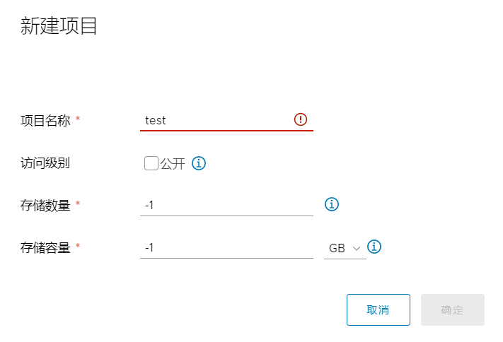
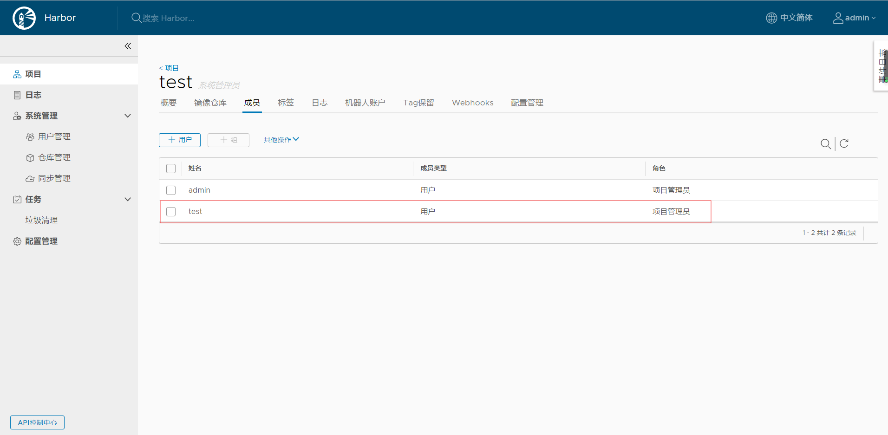
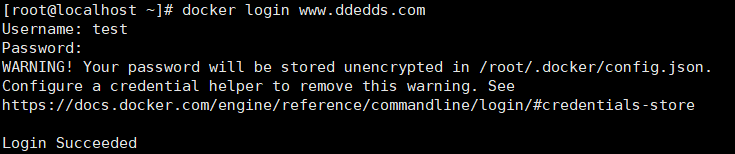

Harbor基本使用

## 介绍

[TOC]

- 新建用户

  

- 新建项目

  

- 将用户加入到项目中，并设置相应权限

  

- 客户端使用该用户登录

  

-  往该仓库中推送镜像

```http
docker pull hello-world
#给镜像打tag
docker tag docker.io/hello-world:latest www.ddedds.com/test/hello-world:latest
#push到仓库
docker push www.ddedds.com/test/hello-world:latest
```

  

