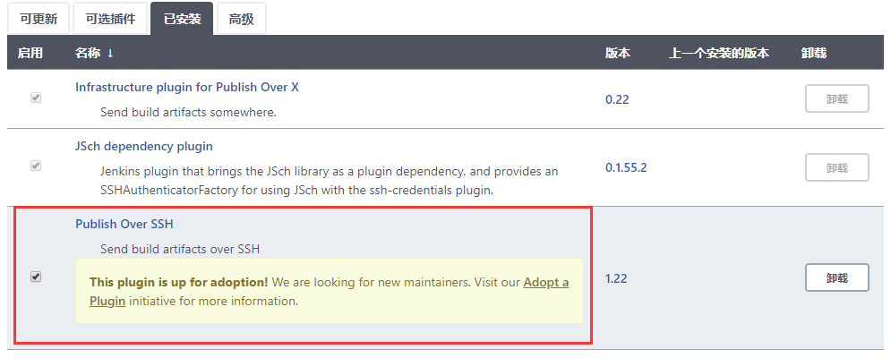
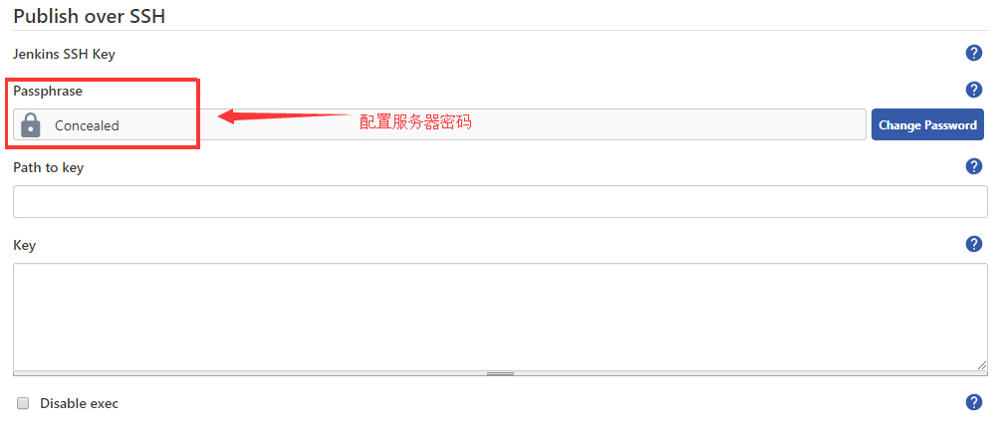
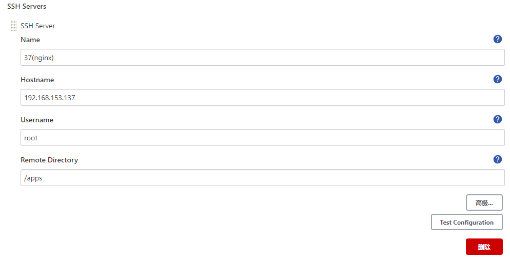
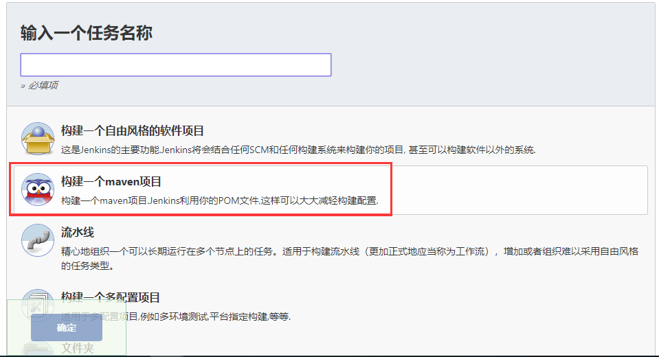
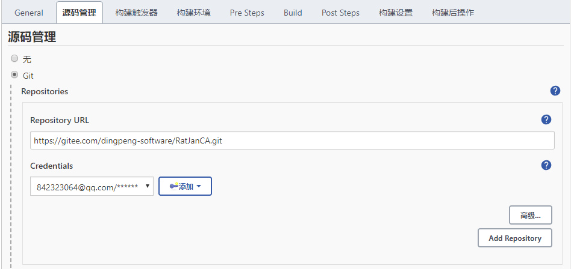
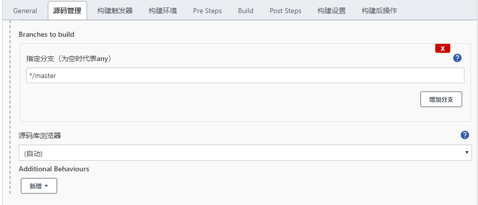
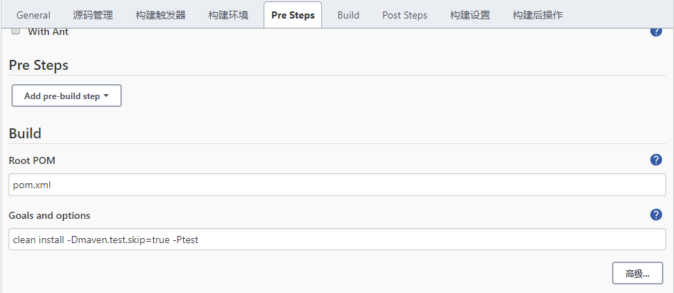
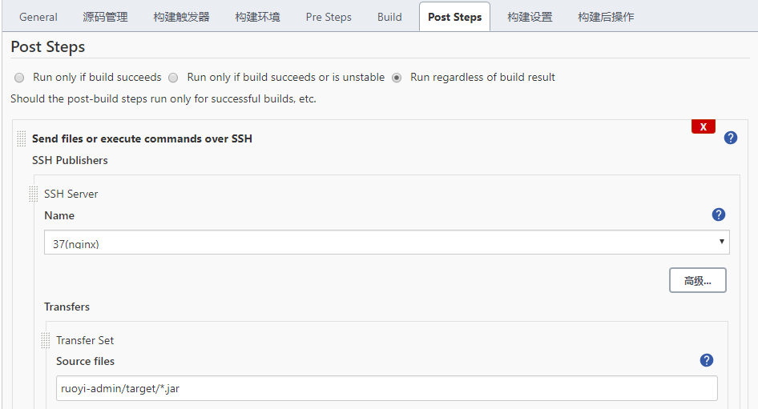
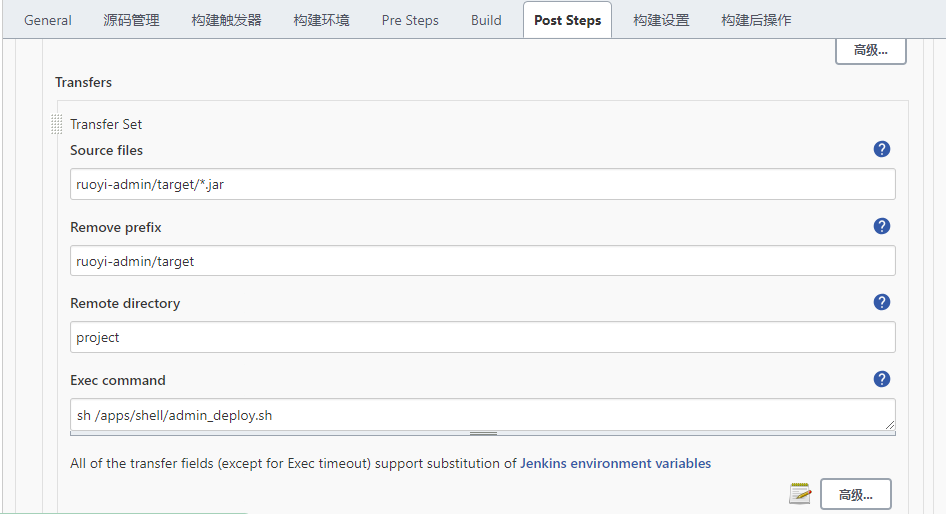

# Jenkins发布Maven项目

## 介绍

[TOC]

**安装环境：**

**system：CentOS7**

## Jenkins发布Maven项目

1. 安装Publish Over SSH插件

   

2. 系统管理，全局工具配置，新增SSH配置

   

   

3. 新建maven任务

   

4. 配置任务

   

   

   

   

   

   

  ```shell
#admin_deploy.sh
export JAVA_HOME=/apps/jdk1.8.0_251
export CLASSPATH=.:$JAVA_HOME/jre/lib/rt.jar:$JAVA_HOME/lib/dt.jar:$JAVA_HOME/lib/tools.jar 
export PATH=$PATH:$JAVA_HOME/bin
APP_NAME=ruoyi-admin.jar
#找到包含AppName的进程
PROCESS=`ps -ef|grep $APP_NAME|grep -v grep  |awk '{ print $2}'`
if [ $PROCESS ]; then
  
	#循环停用进程直到成功
	while :
	do
	  kill -9 $PROCESS > /dev/null 2>&1
	  if [ $? -ne 0 ];then
	   break
	  else
	   sleep 5
	   continue
fi
done
echo 'Stop Successed'
  
else
  
echo "NOT NULL"
  
fi


#启动应用
nohup  java -jar /apps/project/$APP_NAME >>/apps/project/start.log 2>>/apps/project/startError.log &

#sleep等待15秒后，判断包含AppName的线程是否存在
sleep 15
if test $(pgrep -f $APP_NAME|wc -l) -eq 0
then
   echo "Start Failed"
else
   echo "Start Successed"
fi
  ```

6.构建任务

