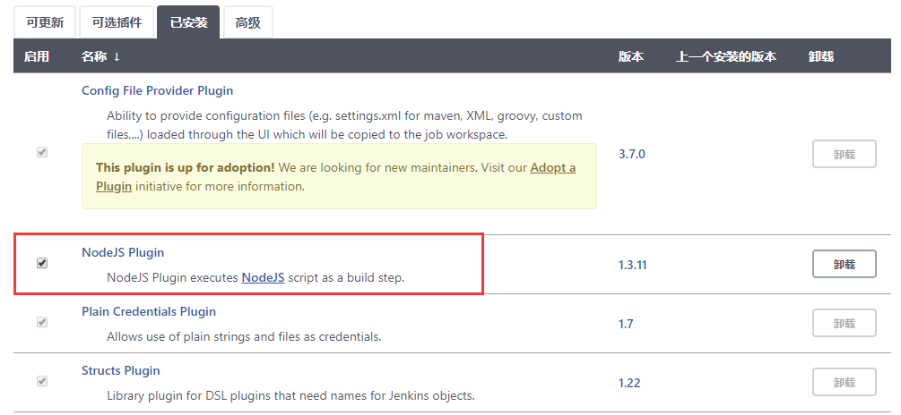
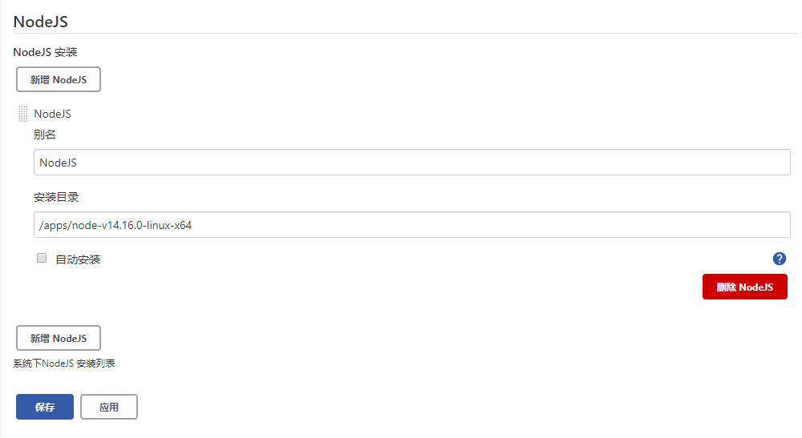
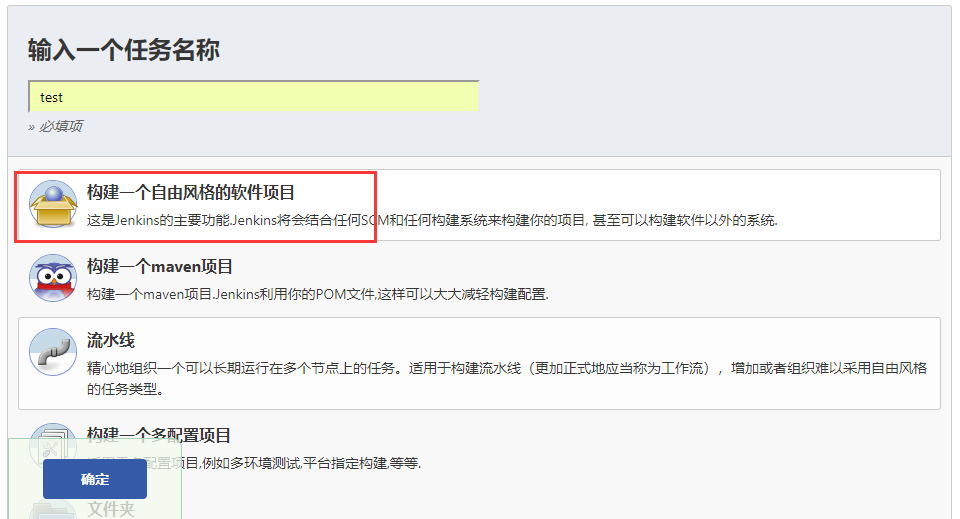
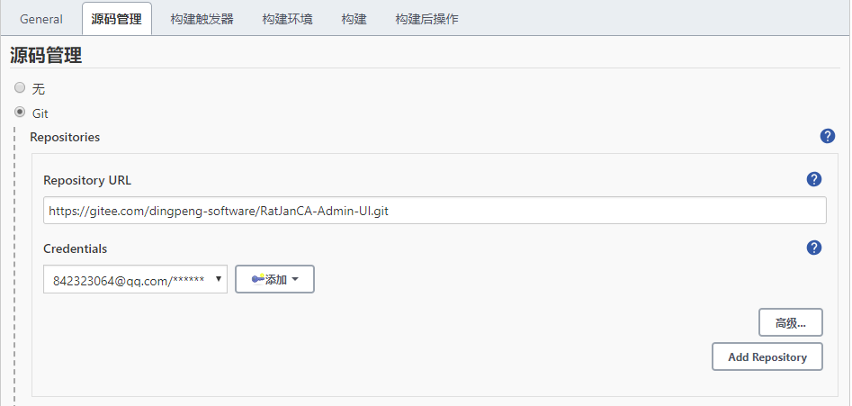
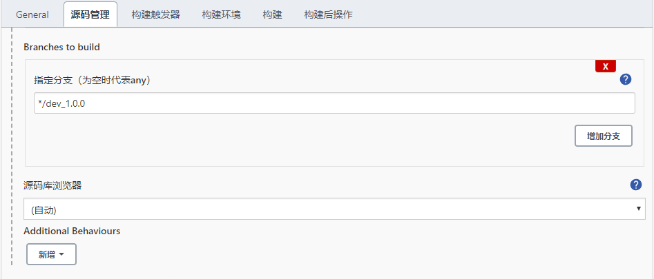
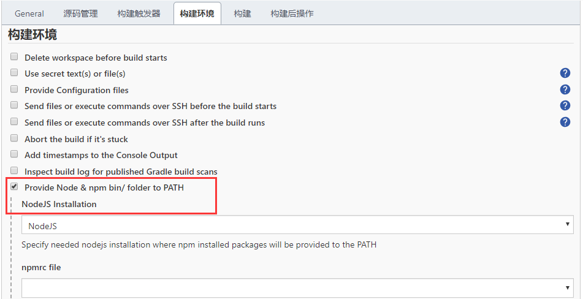
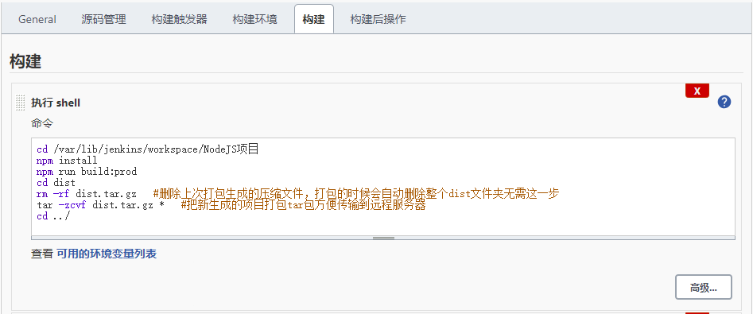
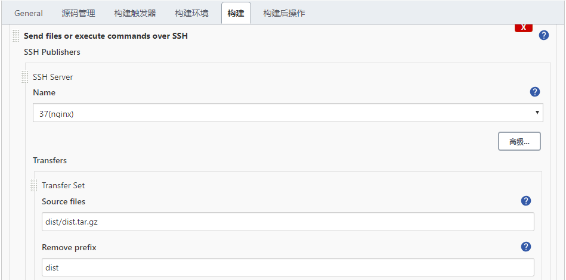
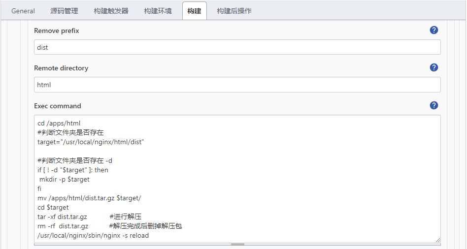

# Jenkins构建发布Vue项目

## 介绍

[TOC]

**安装环境：**

**system：CentOS7**

## Jenkins构建发布Vue项目

1. 安装nodejs插件

   

2. 系统管理，全局工具配置，新增nodejs配置

   

3. 新建自由流任务

   

4. 配置任务

   

   

   

   

   

   

  ```shell
#shell
cd /var/lib/jenkins/workspace/NodeJS项目
npm install
npm run build:prod
cd dist 
rm -rf dist.tar.gz   #删除上次打包生成的压缩文件，打包的时候会自动删除整个dist文件夹无需这一步
tar -zcvf dist.tar.gz *   #把新生成的项目打包tar包方便传输到远程服务器
cd ../

#command
cd /apps/html
#判断文件夹是否存在
target="/usr/local/nginx/html/dist"

#判断文件夹是否存在 -d
if [ ! -d "$target" ]; then
 mkdir -p $target
fi
mv /apps/html/dist.tar.gz $target/
cd $target
tar -xf dist.tar.gz            #进行解压
rm -rf  dist.tar.gz           #解压完成后删掉解压包
/usr/local/nginx/sbin/nginx -s reload
  ```

5.nginx配置

	location /dist/ {
	        root   html;
	    try_files $uri $uri/ /dist/index.html;
	        index  index.html index.htm;
	    }
		
	location /prod-api/{
		proxy_set_header Host $http_host;
		proxy_set_header X-Real-IP $remote_addr;
		proxy_set_header REMOTE-HOST $remote_addr;
		proxy_set_header X-Forwarded-For $proxy_add_x_forwarded_for;
		proxy_pass http://localhost:8080/;
	}
6. 构建任务

